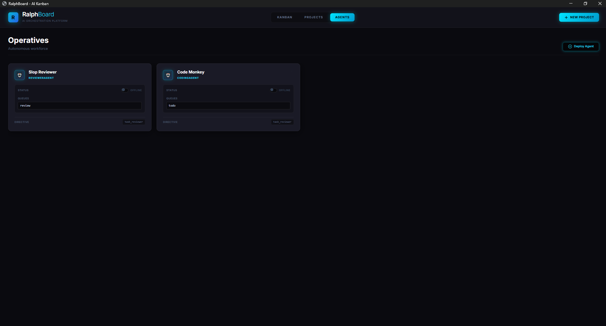

# RalphBoard

<div align="center">


**An AI-powered autonomous development orchestration platform with a cyberpunk aesthetic**

[](https://python.org)
[](LICENSE)
[](https://opencode.ai)

[Features](#-features) • [Installation](#-installation) • [Usage](#-usage) • [Architecture](#-architecture) • [Configuration](#-configuration)

</div>

---

## 🎯 Overview

**RalphBoard** is a AI orchestration platform that manages autonomous coding agents through an intuitive Kanban interface. Built on the "Ralph Wiggum Loop" process, it enables AI agents to work independently on tasks with built-in quality assurance and failure recovery.


### Why RalphBoard?
I found with other AI orchestration platforms: 
- Some are not autonomous.
- Some don't use fresh context for each task. 
- Some don't have a triage system to handle failed tasks.
- Some don't have a way to visualize the task workflow. 
- Some don't have a way to handle failed tasks.
RalphBoard addresses all of these issues.

### Key Highlights

- 🤖 **Autonomous AI Agents** - Deploy coding and review agents that work independently
- 🔄 **Ralph Wiggum Loop** - Iterative development with failure detection & retry logic
- 🎨 **Cyberpunk UI** - Dark, neon-accented interface with glowing interactive elements
- 📊 **Project Management** - Visual Kanban board with drag-and-drop task organization
- 🔍 **Quality Assurance** - Built-in reviewer agents validate task completion
- 🚨 **Triage System** - Failed tasks automatically move to triage for review

---

## ✨ Features


### 🤖 AI Agent System

- **CodingAgent**: Executes development tasks using OpenCode CLI integration
- **ReviewerAgent**: Validates task completion against success criteria
- **GeneratorAgent**: Auto-generates task breakdowns from project descriptions
- **Custom Agents**: Deploy multiple agents with specialized system prompts


### 📋 Task Management

- **Kanban Board**: Drag-and-drop interface with 6 status columns (Triage, Backlog, Todo, In Progress, Review, Complete)
- **Task Dependencies**: Set blockers to enforce execution order
- **Automatic Transitions**: Tasks move through pipeline based on agent results
- **Review Tracking**: Monitor retry attempts with configurable limits


### 🎨 Modern UI/UX its a work in progress

- **Dark Cyberpunk Theme**: Pure black (`#0a0a0f`) background with cyan/red/purple accents
- **Glowing Effects**: Neon-style borders and box-shadows on hover
- **Responsive Design**: Optimized for desktop workflows
- **Real-time Updates**: Live status updates from agent execution

### 🔧 Developer Experience

- **Local LLM Support**: Compatible with any OpenAI-compatible API
- **Terminal Windows**: Optional separate console for agent debugging
- **Auto-approval**: Pre-configured OpenCode permissions for hands-free execution
- **SQLite Backend**: Lightweight, portable database

---

## 🚀 Installation

### Prerequisites

- **Python 3.8+**
- **Node.js** (for OpenCode CLI)
- **OpenCode CLI**: Install via `npm install -g opencode-ai`

### Step 1: Clone Repository

```bash
git clone https://github.com/yourusername/ralphboard.git
cd ralphboard
```

### Step 2: Install Python Dependencies

```bash
# Create virtual environment
python -m venv .venv

# Activate (Windows)
.venv\Scripts\activate

# Activate (Mac/Linux)
source .venv/bin/activate

# Install dependencies
pip install -r requirements.txt
```

### Step 3: Configure Environment

Create a `.env` file in the project root:

```env
# OpenAI-Compatible API Configuration
OPENAI_API_KEY=your-api-key-here
OPENAI_BASE_URL=http://127.0.0.1:8073/v1  # Or your LLM server
OPENAI_MODEL_NAME=gpt-4o

# Agent Loop Configuration
MAX_ITERATIONS=15              # Max iterations for CodingAgent
MAX_REVIEW_ATTEMPTS=3          # Max review failures before triage
MAX_REVIEW_ITERATIONS=5        # Max iterations for ReviewerAgent
```

### Step 4: Initialize Database

The database is automatically created on first run. To manually initialize:

```bash
python app.py
```

---

## 🎮 Usage

### Starting the Application

```bash
python app.py
```

The Eel-based GUI will launch automatically at `http://localhost:8000`.

### Creating a Project

1. Click **"+ New Project"** button
2. Enter:
   - **Title**: Project name
   - **Description**: Detailed requirements for the LLM task generator
   - **Working Directory**: Absolute path to your project folder
3. Click **"Generate"** to auto-create tasks via GeneratorAgent

### Deploying Agents

1. Navigate to the **"Agents"** tab
2. Click **"+ Deploy Agent"**
3. Configure:
   - **Agent Name**: Unique identifier
   - **Specialization**: `CodingAgent`, `ReviewerAgent`, or `GeneratorAgent`
   - **Directive**: Select system prompt from `prompts.py`
   - **Show Terminal**: Enable to see agent execution in separate window
   - **Assigned Queues**: Select which task statuses this agent monitors
4. Toggle **"Status"** to `Active` to start auto-assignment

### Task Workflow

```
┌─────────┐     ┌──────────┐     ┌──────┐     ┌────────────┐     ┌────────┐     ┌──────────┐
│ Triage  │ ──▶ │ Backlog  │ ──▶ │ Todo │ ──▶ │ In Progress│ ──▶ │ Review │ ──▶ │ Complete │
│ (Failed)│     │(Blocked) │     │      │     │  (Coding)  │     │  (QA)  │     │   (Done) │
└─────────┘     └──────────┘     └──────┘     └────────────┘     └────────┘     └──────────┘
```

### Manual Controls

- **Drag Tasks**: Move between columns to override status
- **Edit Task**: Click any task card to view/edit details
- **Dependencies**: Set task blockers via the dependency dropdown
- **Review Count**: Track how many times a task has failed review

---

## 🏗 Architecture

### System Components

```
RalphBoard/
├── app.py              # Eel backend, SQLite interface, API routes
├── agents.py           # Agent classes (CodingAgent, ReviewerAgent, GeneratorAgent)
├── prompts.py          # System prompt library
├── agent_runner.py     # Standalone agent executor for separate windows
├── web/
│   ├── index.html      # Cyberpunk UI (Tailwind CSS)
│   └── script.js       # Frontend logic, Sortable.js integration
├── ralphboard.db       # SQLite database
└── .env                # Configuration
```

### Database Schema

**Projects Table**
```sql
CREATE TABLE projects (
    id INTEGER PRIMARY KEY,
    name TEXT NOT NULL,
    description TEXT,
    working_dir TEXT,
    status TEXT DEFAULT 'active',  -- 'active' | 'completed'
    created_at TIMESTAMP DEFAULT CURRENT_TIMESTAMP
);
```

**Tasks Table**
```sql
CREATE TABLE tasks (
    id INTEGER PRIMARY KEY,
    project_id INTEGER,
    title TEXT NOT NULL,
    description TEXT,
    success_criteria TEXT,
    is_inprogress INTEGER DEFAULT 0,
    is_review INTEGER DEFAULT 0,
    is_complete INTEGER DEFAULT 0,
    is_failed INTEGER DEFAULT 0,
    review_count INTEGER DEFAULT 0,
    dependency_id INTEGER,
    created_at TIMESTAMP DEFAULT CURRENT_TIMESTAMP,
    FOREIGN KEY (project_id) REFERENCES projects(id),
    FOREIGN KEY (dependency_id) REFERENCES tasks(id)
);
```

**Agents Table**
```sql
CREATE TABLE agents (
    id INTEGER PRIMARY KEY,
    name TEXT NOT NULL,
    role TEXT,                    -- 'CodingAgent' | 'ReviewerAgent' | 'GeneratorAgent'
    system_prompt_key TEXT,
    status TEXT DEFAULT 'Idle',
    show_window INTEGER DEFAULT 0,
    is_active INTEGER DEFAULT 0,
    target_queues TEXT,           -- JSON array: ["todo", "review"]
    created_at TIMESTAMP DEFAULT CURRENT_TIMESTAMP
);
```

### Ralph Wiggum Loop

The core development pattern that enables autonomous iteration:

```python
while iteration_count <= MAX_ITERATIONS:
    # 1. Execute task via OpenCode CLI
    result = subprocess.run(["opencode", "run", ralph_prompt])
    
    # 2. Check for completion promise
    if "<promise>COMPLETE</promise>" in result.stdout:
        return {"success": True}
    
    # 3. Log failure and retry with context
    failure_log.append(f"Iteration {iteration_count} failed")
    iteration_count += 1

return {"success": False, "error": "Max iterations reached"}
```

**Key Benefits:**
- Agents learn from previous failures
- Prevents false positives via explicit completion signals
- Configurable iteration limits prevent infinite loops

---

## ⚙️ Configuration

### Environment Variables

| Variable | Default | Description |
|----------|---------|-------------|
| `OPENAI_API_KEY` | `no-key-required` | API key for LLM service |
| `OPENAI_BASE_URL` | `http://127.0.0.1:8073/v1` | OpenAI-compatible endpoint |
| `OPENAI_MODEL_NAME` | `gpt-4o` | Model identifier |
| `MAX_ITERATIONS` | `15` | Max Ralph Loop iterations for CodingAgent |
| `MAX_REVIEW_ATTEMPTS` | `3` | Review failures before moving to Triage |
| `MAX_REVIEW_ITERATIONS` | `5` | Max iterations for ReviewerAgent per review |

### Custom System Prompts

Edit `prompts.py` to add new agent directives:

```python
SYSTEM_PROMPTS = {
    "coding_agent": "You are an expert software engineer...",
    "task_generator": "You are a technical project manager...",
    "reviewer_agent": "You are a strict QA engineer...",
    # Add your custom prompts here
    "custom_agent": "Your specialized instructions..."
}
```

### OpenCode Auto-Approval

RalphBoard automatically creates `.opencode/ralph-auto-config.json` to bypass permission prompts:

```json
{
  "permission": {
    "read": "allow",
    "edit": "allow",
    "bash": "allow",
    "external_directory": "allow"
  }
}
```

---

## 🎨 UI Customization

### Color Palette

The cyberpunk theme uses CSS variables defined in `web/index.html`:

```css
:root {
    --bg-black: #0a0a0f;        /* Main background */
    --bg-dark: #12121a;         /* Secondary surfaces */
    --bg-card: #1a1a26;         /* Card backgrounds */
    
    --cyan: #00e5ff;            /* Primary accent */
    --red: #ff4757;             /* Error/danger */
    --purple: #8a5cf6;          /* Secondary accent */
    --green: #10d97c;           /* Success */
    
    --glow-cyan: rgba(0, 229, 255, 0.4);
    --glow-red: rgba(255, 71, 87, 0.4);
    --glow-purple: rgba(138, 92, 246, 0.4);
}
```

### Modifying Glows

Adjust shadow intensity in `web/index.html`:

```css
.glow-card:hover {
    box-shadow: 0 0 20px var(--glow-cyan);  /* Increase spread for stronger glow */
}
```

---

## 🐛 Troubleshooting

### Common Issues

**1. "opencode: command not found"**
```bash
npm install -g opencode-ai
```

**2. Database Locked**
- Ensure only one instance of `app.py` is running
- Check for orphaned Python processes

**3. Agent Not Picking Up Tasks**
- Verify agent `is_active = 1` in database
- Check `target_queues` JSON matches task status
- Ensure OpenCode CLI is in system PATH

**4. UI Not Loading**
- Check if port 8000 is available
- Disable browser extensions (uBlock, etc.)
- Clear browser cache

---

## 🤝 Contributing

Contributions are welcome! Please follow these guidelines:

1. Fork the repository
2. Create a feature branch (`git checkout -b feature/amazing-feature`)
3. Commit changes (`git commit -m 'Add amazing feature'`)
4. Push to branch (`git push origin feature/amazing-feature`)
5. Open a Pull Request

---

## 📄 License

This project is licensed under the MIT License - see the [LICENSE](LICENSE) file for details.

---

## 🙏 Acknowledgments

- **OpenCode** - Agentic coding framework powering the agents
- **Eel** - Python-JavaScript bridge for desktop GUI
- **Sortable.js** - Drag-and-drop Kanban functionality
- **Tailwind CSS** - Utility-first styling framework

---

## 📞 Support

- **Issues**: [GitHub Issues](https://github.com/yourusername/ralphboard/issues)
- **Discussions**: [GitHub Discussions](https://github.com/yourusername/ralphboard/discussions)

---

<div align="center">

**Made with ❤️ by the RalphBoard Team**

⭐ Star this repo if you find it useful!

</div>
